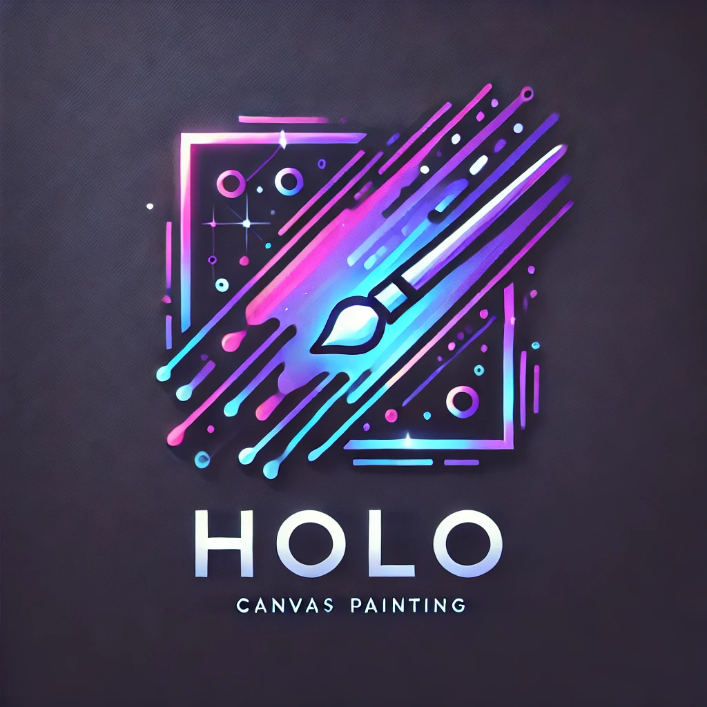

# What is Holo?
  Holo is my Computer Engineering capstone project at Bellarmine University. It involves to major components:
  <br>
  1. The Holo Canvas App
     - Simple drawing features and modern GUI.
     - Canvas to AI focus: You draw a simple picture, enter a simple prompt, or both, and generate and image onto the canvas.
     - Ability to save canvas drawings.
  2. Device control using hand tracking.
     - Mediapipe hand tracking allows user to stand infront of a projected display and control their system with just hand gestures (mouse movement, click, drags, keymacros)
  <br>
  The combination of the Holo Canvas App and Hand Tracking Gesture Control allows for an interactive canvas drawing experience on a projected display backed by AI image generation.

# When could Holo be used?
- In a teaching setting: a modern whiteboard with on the fly AI sketck-to-image genration.
- In a creative brainstorming session: trying to get a storyboard developed for a project.
- In a business setting: outlining project demands and system specifications
- Or... Just for fun!

# Holo Canvas Feature Section
- [x] Holo GUI Outlined
- [x] Selectable Pen Colors
- [x] Selectable Brush Size
- [ ] Line, rectangle, circle, paint bucket tool.
- [ ] Canvas Layers
- [ ] Canvas Element Transform, Rotation, and Scale
- [ ] Holo Canvas Makes API Call to AI Image Generaion Model (using external computing resources)
- [ ] Save and open canvas files
- [ ] Change canvas dimensions

# Gesture Control Feature Section
- [x] Pinch to click
- [x] Camera bounds setting (to map local enviroinment space to screen space)
- [ ] Macro based on gestures
- [ ] Clean handling when hand track is lost (behind user or out of frame)

# Technical Tidbits
- Tkinter based GUI (custom tkinter for themeing)
- Mediapipe hand tracking for gesture control

# Holo Canvas App Dependencies
- Tkinter
  ```
  pip install tk
  ```
- Custom Tkinter
  ```
  pip install customtkinter --upgrade
  ```
- Pillow
  ```
  pip install pillow
  ```

# Gesture Control Dependencies
- OpenCV
- Mediapipe
- Numpy
- 

<br>
<br>

## Other Directions Holo Could Be Taken
- Hand tracking and AI based image-to-mesh reconstruction to skin a 3D model using bone points as tracked by Mediapipe
- 
