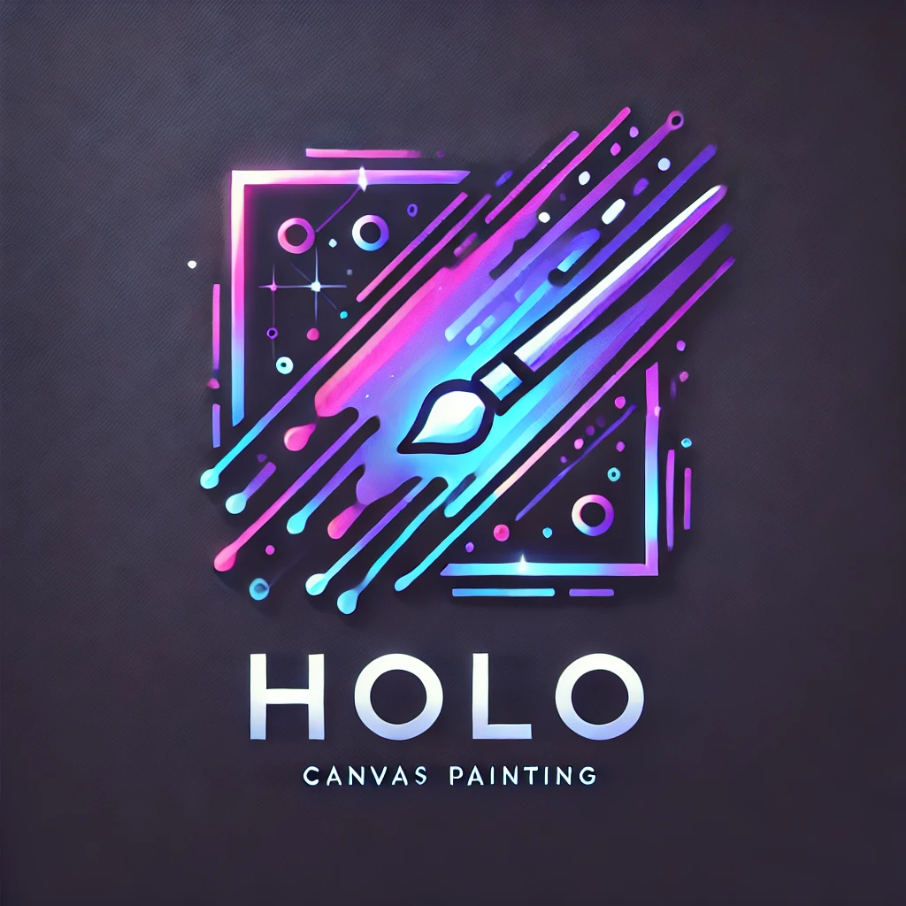

# What is Holo?

Holo is my Computer Engineering capstone project at Bellarmine University. See the project absract below:
<br>

Project Holo is a multimodal artificial intelligence (AI) system that integrates multiple AI technologies into a dynamic, hand-gesture-controlled canvas painting and image generation application. With the increasing integration of AI in consumer applications, Holo provides users with an intuitive and interactive platform for AI-driven image creation. 

Holo is written in python but can be compiled down to C code for slightly increased performance. The graphical user interface (GUI) utilizes a library called “tkinter” with a custom theme wrapper called “custom tkinter.” Holo users can create a sketch using drawing tools such as a pen brush, fill tool, transform, and rectangle tool, and/or enter a text-based image generation prompt. Upon initiating the "Generate AI Image" function, Holo processes the provided inputs via an API call, using a variety of selectable AI models which convert the sketch and/or prompt into an image that appears in the designated output tab.

Holo supports standard interaction methods, including keyboard, mouse, and tablet pen input. Additionally, it enhances user engagement by incorporating a projector-interface and in-app hand tracking using MediaPipe – a Google solution suite enabling hand tracking and pose estimation in real time video feeds.  The local hand position of a user in frame, derived from the MediaPipe hand solution, is mapped to screen space to control the on-screen cursor, while gesture-based controls — such as pinching the index finger and thumb to emulate a mouse press — enable a seamless, touch-free interaction experience. This innovative approach makes Holo a versatile tool for AI-assisted digital art creation, expanding the possibilities of human-computer interaction in creative applications.


# When could Holo be used?

- In a teaching setting: a modern whiteboard with on the fly AI sketck-to-image genration.
- In a creative brainstorming session: trying to get a storyboard developed for a project.
- In a business setting: outlining project demands and system specifications
- Or... Just for fun!

# Holo Canvas Feature Section

- [x] Holo GUI Outlined
- [x] Selectable Pen Colors
- [x] Selectable Brush Size
- [x] Line, rectangle, circle, paint bucket tool.
- [ ] Canvas Layers
- [x] Canvas Element Transform
- [ ] Holo Canvas Makes API Call to AI Image Generaion Model (using external computing resources)
- [ ] Save and open canvas files
- [ ] Change canvas dimensions

# Gesture Control Feature Section

- [x] Pinch to click
- [x] Camera bounds setting (to map local enviroinment space to screen space)
- [ ] Macro based on gestures
- [ ] Clean handling when hand track is lost (behind user or out of frame)

# Technical Tidbits

- Tkinter based GUI (custom tkinter for themeing)
- Mediapipe hand tracking for gesture control

# Holo Canvas App Dependencies

- Tkinter
  ```
  pip install tk
  ```
- Custom Tkinter
  ```
  pip install customtkinter --upgrade
  ```
- Pillow
  ```
  pip install pillow
  ```

# Compiling to Standalone exe with nuitka

```
python -m nuitka --windows-console-mode=disable --standalone holo.py
```

# Gesture Control Dependencies

- OpenCV
- Mediapipe
- Numpy
-

<br>
<br>

## Other Directions Holo Could Be Taken

- Hand tracking and AI based image-to-mesh reconstruction to skin a 3D model using bone points as tracked by Mediapipe
-
